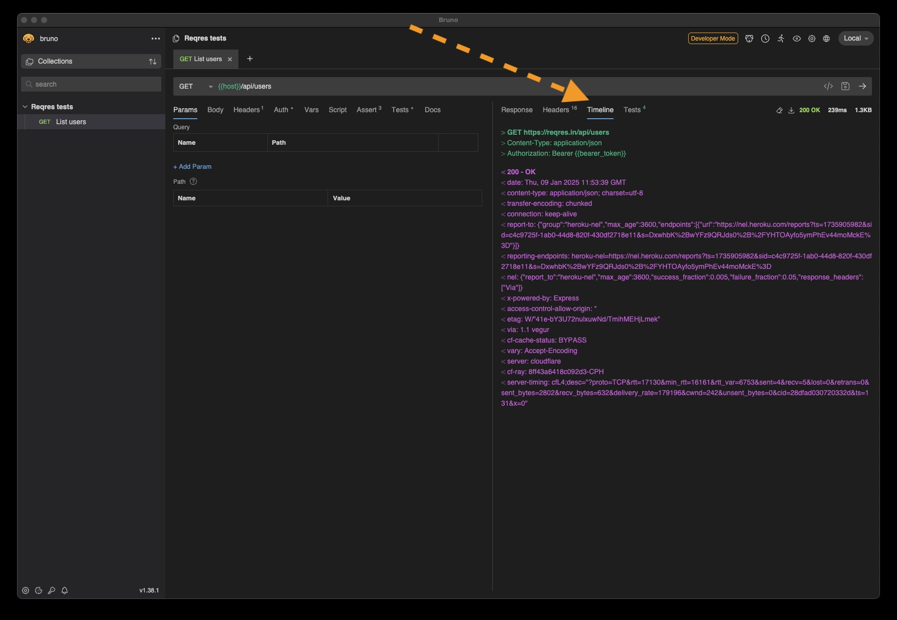

# See Your Requests

I did a lot of work using **httpie** so I forgot how I saw the actual requests in Bruno.

Luckily [StackOverflow][stackoverflow] had the answer.

> You will find the sent request (including the called URI and header fields) in the "Timeline" tab at the right-hand side of Bruno's GUI (close to the "Response" tab) - see screenshot attached:
>

...

This is my own screenshot.

## Resources and References

- [StackOverflow: "Is there a way to see the requests made using Bruno?"][stackoverflow]

[stackoverflow]: https://stackoverflow.com/questions/77848215/is-there-a-way-to-see-the-requests-made-using-bruno
