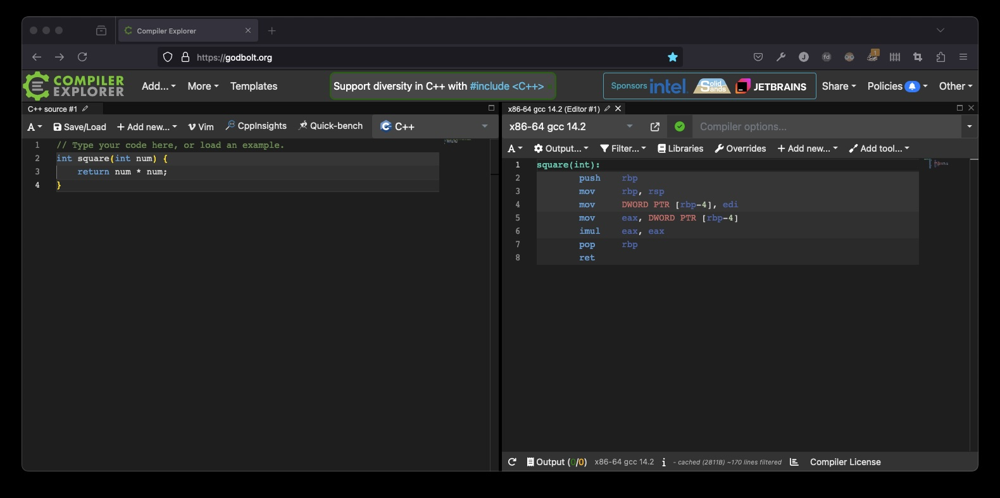

# Inspect your C using Godbolt

Heard about this on [Programming Throwdown podcast episode 155][EPISODE155].

I am not a C-programmer at all, but that does not mean that I am not impressed with this tool. I have not idea about it's practical use and value, but I guess it could be useful learning or debugging C code (when you are a C programmer/newbie).

[][GODBOLT]

## Resources and References

- [Godboldt][GODBOLT]
- [Programming Throwdown](https://www.programmingthrowdown.com/)
- [Programming Throwdown podcast episode 155][EPISODE155]

[EPISODE155]: https://www.programmingthrowdown.com/episodes/156-perl-and-regular-expressions/
[GODBOLT]: https://godbolt.org/
