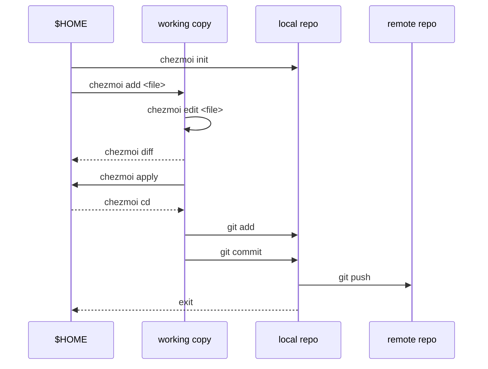

# Use chezmoi

With the new ability to add [Mermaid](https://mermaid-js.github.io/mermaid/#/) diagrams to [GitHub Markdown](https://github.blog/2022-02-14-include-diagrams-markdown-files-mermaid/), I just needed to try this out.

This is an embedded version of the official sequence diagram from the `chezmoi` [website](https://www.chezmoi.io/quick-start/#start-using-chezmoi-on-your-current-machine).

