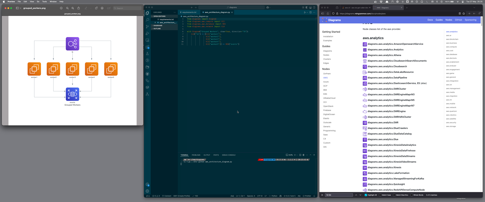

# Diagrams as Python Code

I love diagrams. I am not good a drawing or painting or similar, but I low diagrams and I am very fond of visuals.

In my work diagrams play an important role and it is important to be able to create diagrams.

Other challenges is being able to both create diagrams fast, as it can be a very time consuming task and also versioning and maintaining them.

When I discovered Mermaid I was thrilled. I recently [discovered][MEDIUM] "[Diagrams][DIAGRAMS]" an alternative to Mermaid where you express your diagrams using Python code.

The concept is the same, the cool thing here is that I can very fast create AWS themed diagrams, yes they are lacking some of the elements I get when drawing manually in Draw.io but for quick sketches this is sufficient.

Here is an example from the documentation:

```python
from diagrams import Diagram
from diagrams.aws.compute import EC2
from diagrams.aws.database import RDS
from diagrams.aws.network import ELB

with Diagram("Grouped Workers", show=True, direction="TB"):
    ELB("lb") >> [EC2("worker1"),
                  EC2("worker2"),
                  EC2("worker3"),
                  EC2("worker4"),
                  EC2("worker5")] >> RDS("events")
```


I mentioned speed and that speed of the essence so let me give you an introduction to my setup.

I edit the Python in VSCode, which leverages of the benefits there of a good editor, it could be any.

I save the diagram to a file.

In the diagram code you can see the attribute: `show`, if you set the to `True` the diagram open automatically when the Python code is executed (at least on macOS), which is awesome.

If you combine this with: `entr` you get instant gratification.

```shell
ls *.py | entr python aws_architecture_diagram.py
```

So on every save, you get the latest rendition of your diagram.

Here is my desktop.

- Diagram on the right
- Editor in the middle, with `entr` in the terminal
- Diagrams documentation in the browser in the AWS section

Just marvellous.



## Resources and References

- [Diagrams Documentation][DIAGRAMS]
- [Diagrams GitHub Repository](https://github.com/mingrammer/diagrams)
- [Medium: "Diagram as Code; creating AWS architecture diagrams."][MEDIUM]

[DIAGRAMS]: https://diagrams.mingrammer.com/
[MEDIUM]: https://medium.com/@alexmarket/diagram-as-code-creating-aws-architecture-diagrams-085120151ceb
