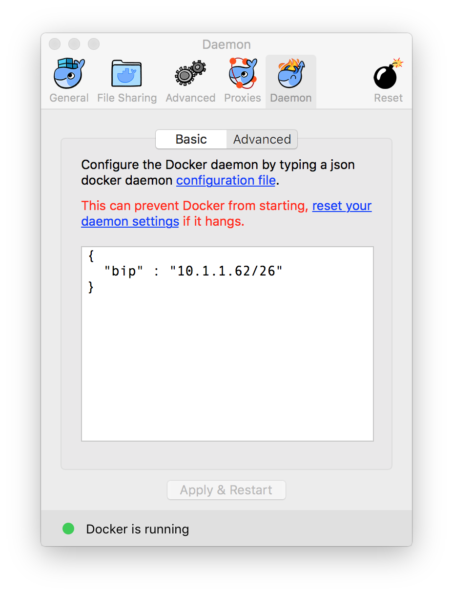

# Define default network addresses used for containers

If you are using **Docker** in a private network and your network clashes with the IP adresses assigned by default (`172.17.0.0/16`) by **Docker**, you can change it easily.

In "Docker for Mac" you go to Preferences -> Daemon -> Advanced



Add something along the line of the following JSON snippet:

```json
{
  "bip" : "10.1.1.62/26"
}
```

If you are using the regular `dockerd`, you have to use the commandline flag `--bip=10.1.1.62/26`

Restart **Docker**

```bash
$ docker network inspect bridge
```

And you should see that you changes have been applied (I have _cut_ out my container listing).

```
[
    {
        "Name": "bridge",
        "Id": "92ce54e3d4f4f6c3dce813ea30dcf503d9258ca8fe84f3840649e117e4f5fe40",
        "Created": "2017-03-21T18:01:37.973374097Z",
        "Scope": "local",
        "Driver": "bridge",
        "EnableIPv6": false,
        "IPAM": {
            "Driver": "default",
            "Options": null,
            "Config": [
                {
                    "Subnet": "10.1.1.62/26",
                    "Gateway": "10.1.1.62"
                }
            ]
        },
        "Internal": false,
        "Attachable": false,
        "Containers": {

            <snip>

        },
        "Options": {
            "com.docker.network.bridge.default_bridge": "true",
            "com.docker.network.bridge.enable_icc": "true",
            "com.docker.network.bridge.enable_ip_masquerade": "true",
            "com.docker.network.bridge.host_binding_ipv4": "0.0.0.0",
            "com.docker.network.bridge.name": "docker0",
            "com.docker.network.driver.mtu": "1500"
        },
        "Labels": {}
    }
]
```

Source: [StackOverflow](https://stackoverflow.com/questions/27344282/how-can-i-change-the-default-assigned-ip-address-for-docker-containers)
Source: [Github](https://github.com/docker/docker/issues/3812)
Source: [Docker](https://docs.docker.com/engine/userguide/networking/work-with-networks/)

