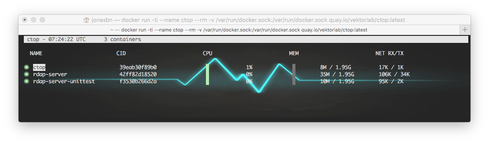

# Use ctop

`ctop` is a magnificent tool for monitoring your containers, it is practically a `top` for containers.

My screenshot above is for a designated terminal setup (with a _funky_ background image), it only shows my active my active containers (you can toogle whether you want to see your active containers or all using `a`), `h` displays help information.

I started out using the **Docker** image, therefor you can see the `ctop` container listed. By now `ctop` is also available via **Homebrew**.

## References

- [GitHub](https://github.com/bcicen/ctop)
