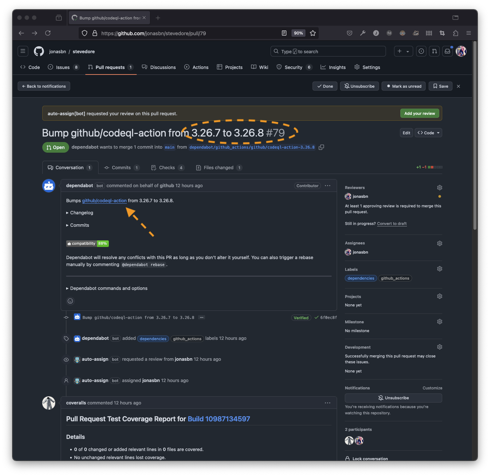
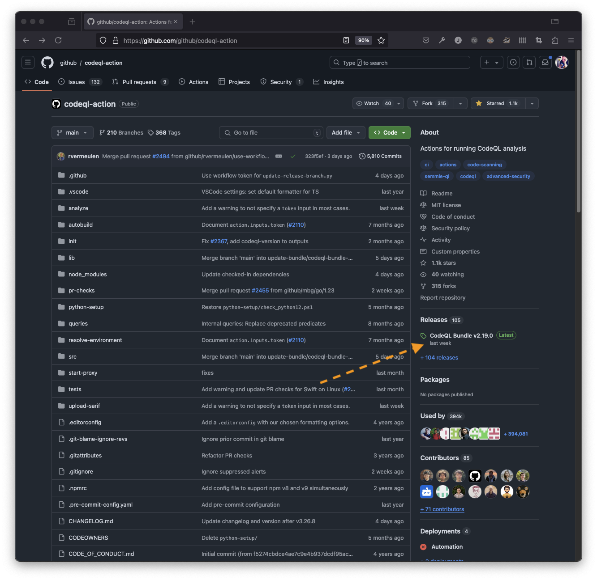
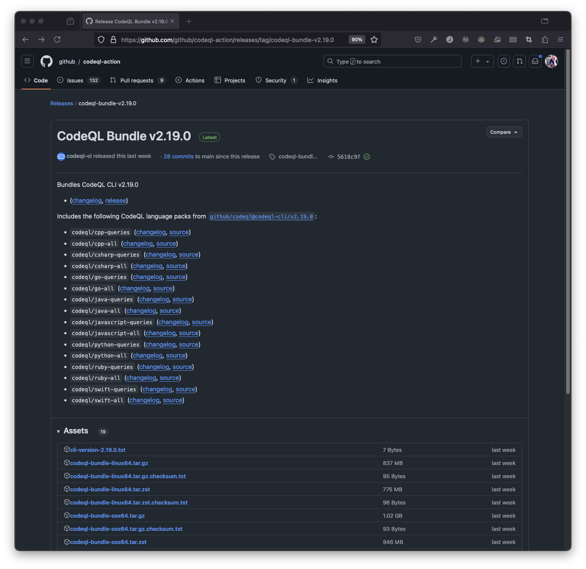
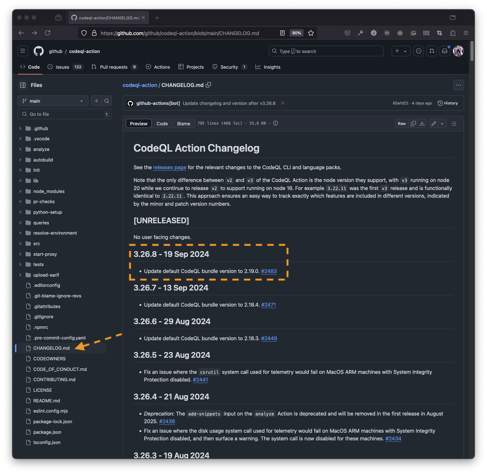

# CodeQL Action

The CodeQL action is awesome, but getting PRs from @Dependabot on updating requires some hoops in order to consume and find what was changed.

You get a PR saying the the `github/codeql` action can be updated, the changelog indicates a version number bump.

You click the change log link and the releases mentioned in the repository are not matching the numbers presented to you in the PR.

The release description does not mention the version number you are looking for

What you have to do is open the `CHANGELOG.md` file

## Resources and References

- [GitHub: github/codeql-action][github/codeql-action]

[github/codeql-action]: https://github.com/github/codeql-action
