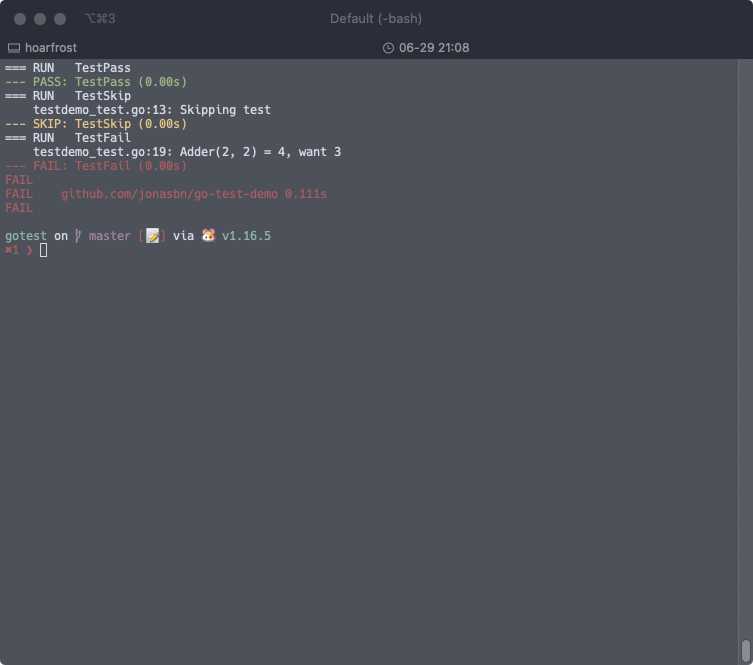
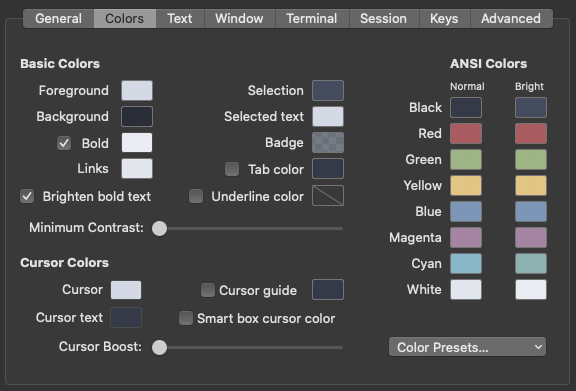

# Colorful Test Output

The standard command line use when testing go:

```bash
$ go test
```

Colors your test output according to your terminal configuration.

[@rakyll](https://github.com/rakyll) has implemented a cool tool [`gotest`][gotest] for coloring your test output, so you have passing tests colored green, failing tests marked red etc.

```bash
$ gotest
```

You can customize the colors for failing tests and passing tests via environment variables using the palette of your terminal.

```bash
GOTEST_PALETTE="red,green" gotest
```

The first color being for failures and the second one being for passes.



To find the colors in for example **iTerm.app** open the Preferences, your profile and the color tab.



Use the names for the colors in the environment variables

And interesting alternative is `richgo` which has even more options (see: [Enriched Test Output](http://jonasbn.github.io/til/go/enriched.html)).

## Resources and References

1. [GitHub: rakyll/gotest][gotest]

[gotest]: https://github.com/rakyll/gotest
