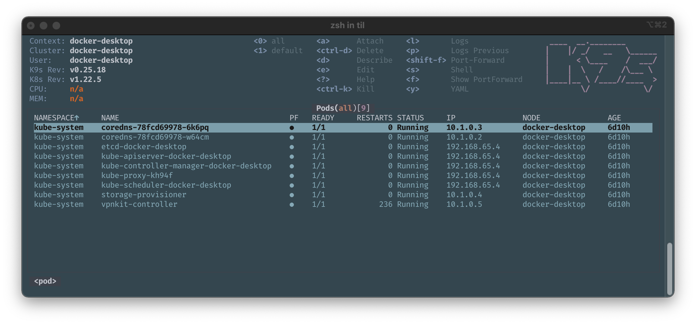

# Use k9s

`k9s` pronounced _canines_ is a beautiful tool to administer you **Kubernetes** cluster.

It can be installed via **Homebrew**.

In conjuction with Docker for Desktop on macOS, upon invocation it would render something along the lines of:



If you invoke `k9s` on your machine it will have the default look (skin).

Mine is changed to match my default terminal look of _solarized dark_.

To change the looks, you can create a file named: `skin.yml` and place it in `$XDG_CONFIG_HOME/k9s/`, you might need to define: `$XDG_CONFIG_HOME`.

You can specify a theme per `context`, so I have made defined: `docker-desktop_skin.yml`, not that I have any other contexts at this time, but in order just to try it out.

The contents of this _skin files_ can be adjusted several examples for inspiration are [available][skins].

If you want to switch between skins and keep your skin _repository_ up to date, I came up with the following recipe.

Jump to the configuration directory

```shell
cd $XDG_CONFIG_HOME
```

Create a directory for `k9s`

```
mkdir k9s
```

Jump to the configuration directory for `k9s`

```
cd k9s
```

Initialize the directory as a Git repository

```
git init
```

Add the `k9s` as a `remote`

```
git remote add -f origin https://github.com/derailed/k9s.git
```

Enable _sparse checkout_

```
git config core.sparseCheckout true
```

Configure _sparse checkout_ to only be the directory with the skins (YAML files).

```
git sparse-checkout set 'skins/*.yml'
```

We inspect to se that we have set it correctly

```
git sparse-checkout list
```

Then we pull the repository

```
git pull origin master
```

And we retrieve the files

```
git checkout master
```

We copy the files up one level

```
cp skins/*.yml .
```

Using symbolic links, we can now switch between the themes, by having our context matching file be the symbolic link

```
ln -sf solarized_dark.yml docker-desktop_skin.yml
```

Suggestions to improvements to this most welcome.

## Resources and References

- [k9s website](https://k9scli.io/)
- [k9s skins][skins]

https://linuxhint.com/what-is-git-sparse-checkout/

[skins]: https://github.com/derailed/k9s/tree/master/skins
