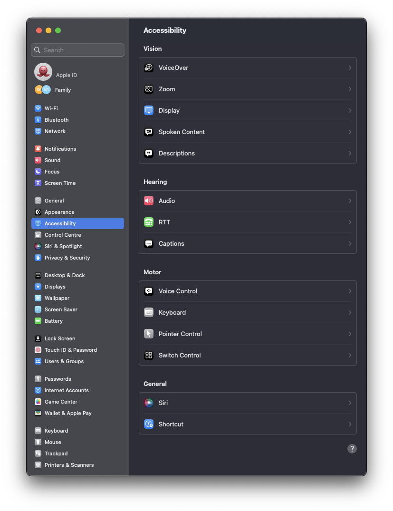
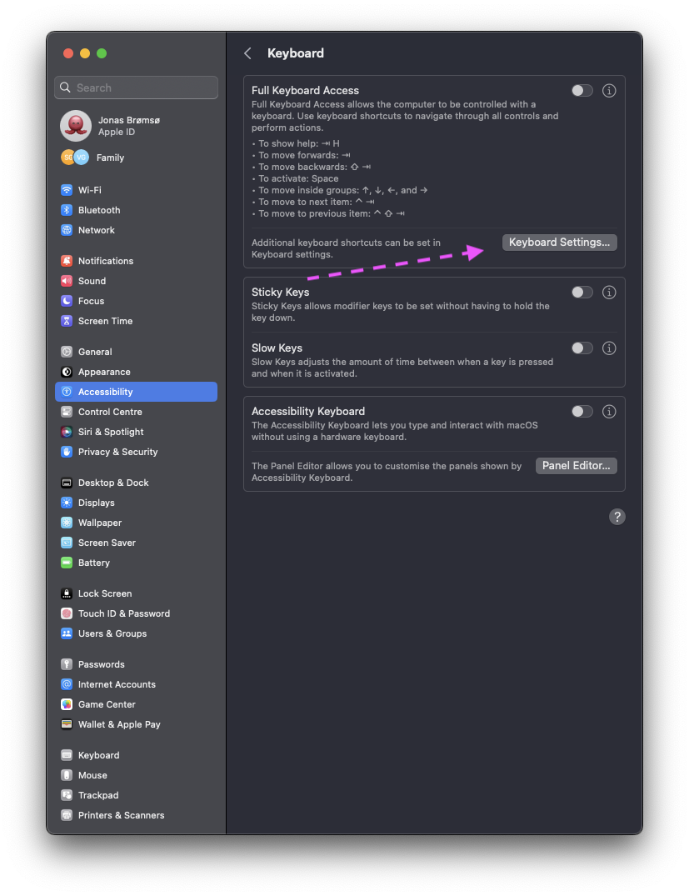
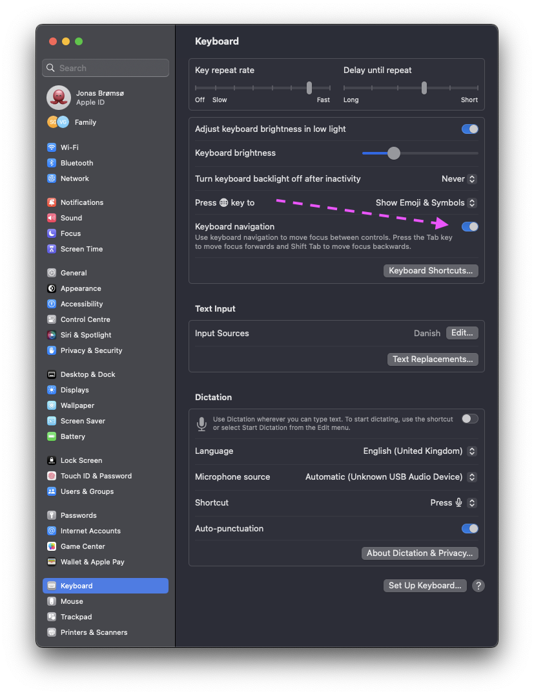

# Set Default Browser From the Command Line

This can be done using the tool: `defaultbrowser`

Works like a charm.

With no arguments lists your browsers and marks the one being the default.

```bash
$ defaultbrowser
  iterm2
* chrome
  firefoxdeveloperedition
  safari
  vlc
  evernote
  netnewswire
```

Setting it is simply by providing an argument, matching the list

```
$ defaultbrowser chrome
```

Do note that this displays a GUI dialog,


If you want to go full command line, you have to tweak some settings on the newer versions of macOS. This is example is taken from: Ventura (`13.4.1`).

1. Open `System Settings`
2. Choose `Accessibility`
3. Choose `Keyboard` on the right hand side



4. Choose `Keyboard Settings...`



1. Toggle `Keyboard navigation` to `On`

> Use keyboard navigation to move focus between controls. Press the Tab key to move forward, Shift-Tab to move backward, and Space to select.



Now you should be able to tab through the dialog and press `Space` to select the browser you just requested as your default browser.

## References

- [StackOverflow: Set default web browser via command line?](https://stackoverflow.com/questions/17528688/set-default-web-browser-via-command-line)
- [GitHub: kerma/defaultbrowser](https://github.com/kerma/defaultbrowser)
