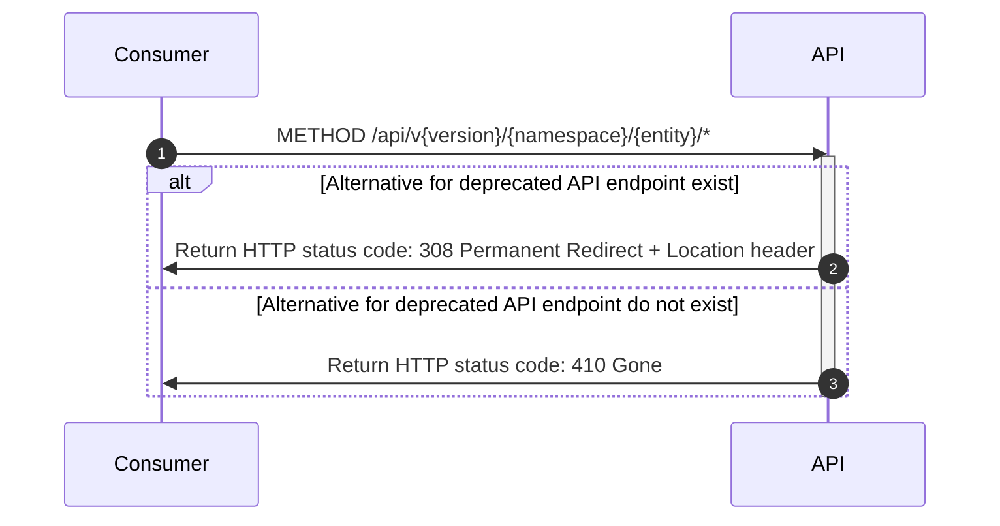

# Deprecating API endpoints

As for deprecation indication using HTTP status code there is no clear specification.

Various answers on StackOverflow and the like tend towards: `410 Gone` alternatively: `405 Method Not Allowed`

Some suggest using: `301 Moved Permanently` or `302 Found`.

Some point to: `501 Not Implemented`

But based on this:

> 501 is the appropriate response when the server does not recognize the request method and is incapable of supporting it for any resource

Quoted from: [MDN](https://developer.mozilla.org/en-US/docs/Web/HTTP/Reference/Status/501), it believe this works on a more fundamental level.

I believe the HTTP status code: `410 Gone` could be used but is not the prettiest solution BUT it could be combined with redirects. Alternatively: `405 Method Not Allowed` might be a better and with better control with assistance: `Allow` header to solve this:

- You have an API and a resource which can be fetched via: `GET`, it would normally return the resource and the HTTP status code: `200 Ok`
- If the API is deprecated one could return `308 Permanent Redirect` for a period of time indicating the replacement via the `Location` header, like a newer version: `/api/v1` to `/api/v2` and this would work for both: `POST` and `GET` where `301 Moved Permanently` only works for `GET`
  - If no replacement is in available return: `410 Gone` could be used
- In due time and after adoption have been made for the new API endpoint, use: `410 Gone` since the API endpoint is gone and it will not come back, personally I think: `410 Gone` is the best fit.

For the Swagger part, do see my TIL on that:

- [Deprecating API endpoints](../swagger/deprecating_api_endpoints.md)

## Resources and References

- [MDN: HTTP response status codes](https://developer.mozilla.org/en-US/docs/Web/HTTP/Reference/Status)
- [MDN: 301 Moved Permanently](https://developer.mozilla.org/en-US/docs/Web/HTTP/Reference/Status/301)
- [MDN: 302 Found](https://developer.mozilla.org/en-US/docs/Web/HTTP/Reference/Status/302)
- [MDN: 308 Permanent Redirect](https://developer.mozilla.org/en-US/docs/Web/HTTP/Reference/Status/308)
- [MDN: 405 Method Not Allowed](https://developer.mozilla.org/en-US/docs/Web/HTTP/Reference/Status/405)
- [MDN: 410 Gone](https://developer.mozilla.org/en-US/docs/Web/HTTP/Reference/Status/410)
- [MDN: 501 Not Implemented](https://developer.mozilla.org/en-US/docs/Web/HTTP/Reference/Status/501)
- [StackOverflow: "What is the correct HTTP status code for: "This version of this API has been discontinued"?](https://webmasters.stackexchange.com/questions/71152/what-is-the-correct-http-status-code-for-this-version-of-this-api-has-been-dis)
