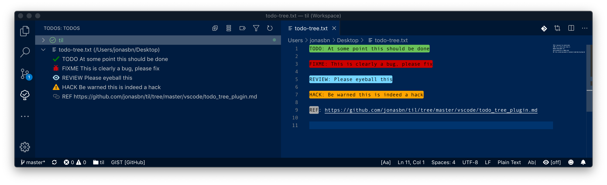

# Todo Tree Extension

This is a really nifty extension for **vscode**.

It lets you define tags in your code like `TODO` and `FIXME` (_the defaults_) which will then be highlighted in your code and will appear in a special sidebar section.



This is my configuration used for the above example.

```json
{
    "todo-tree.autoRefresh": true,
    "todo-tree.defaultHighlight": {
        "type": "text-and-comment"
    },
    "todo-tree.customHighlight": {
        "TODO": {
            "foreground": "black",
            "background": "green",
            "iconColour": "green",
            "icon": "check",
            "type": "text"
        },
        "FIXME": {
            "foreground": "black",
            "background": "red",
            "iconColour": "red",
            "icon": "bug"
        },
        "REVIEW": {
            "foreground": "black",
            "background": "cyan",
            "iconColour": "lightblue",
            "icon": "eye"
        },
        "HACK": {
            "foreground": "black",
            "background": "#FFA500",
            "iconColour": "orange",
            "icon": "alert"
        },
        "REF": {
            "foreground": "black",
            "background": "grey",
            "iconColour": "grey",
            "icon": "link",
            "type": "tag"
        }
    },
    "todo-tree.tags": [
        "TODO",
        "FIXME",
        "REVIEW",
        "HACK",
        "REF"
    ]
}
```

And this is the example:

```
TODO: At some point this should be done

FIXME: This is clearly a bug, please fix

REVIEW: Please eyeball this

HACK: Be warned this is indeed a hack

REF: https://github.com/jonasbn/til/tree/master/vscode/todo_tree_plugin.md
```

As you can see the type for REF (reference) has it's type defined differently.

You can define you own tags and can assign, icons and colour schemes, based on your preferences.

For icons in the sidebar you can use the marvellous [octicons](https://octicons.github.com/)

And for the foreground and background color in the editor you can use the colours: "red", "green", "blue", "yellow", "magenta", "cyan", "grey", "white" or "black". RGB values can also be used (e.g. "#FFA500").

Do note that for the sidebar the string "orange" actually works (see my configuration above).

## References:

- [Visual Studio Marketplace](https://marketplace.visualstudio.com/items?itemName=Gruntfuggly.todo-tree)
